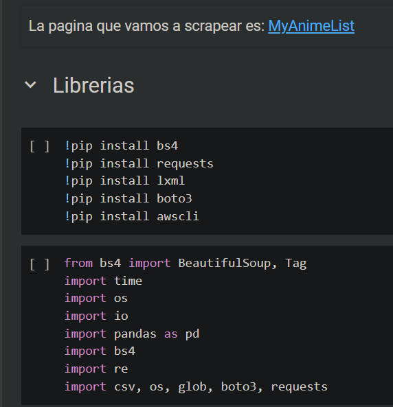
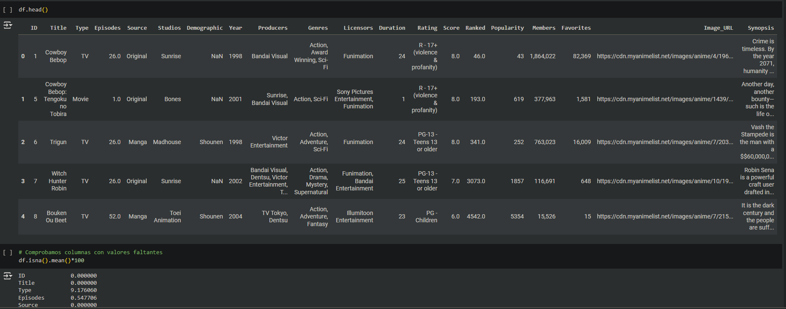
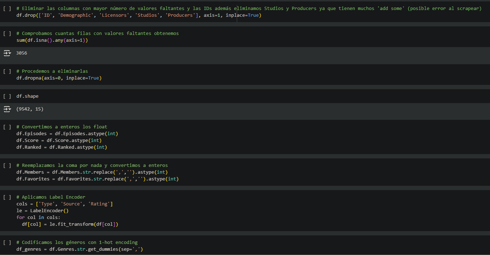

# MyAnimeMatch

Proyecto realizado por [Hanane Arrazouki](https://github.com/HananeArrazouki)

## Justificación y descripción del proyecto
MyAnimeMatch es un proyecto que ofrece una plataforma para recomendar y descubrir anime de manera eficiente y personalizada.

Al contestar una serie de preguntas en la pagina web (streamlit), la Web proporcionará el nombre del anime, imágenes representativas del anime, información sobre el género y el número de episodios, etc. Esto permite a los usuarios tomar decisiones informadas sobre qué anime ver a continuación, ayudándoles a encontrar aquellos que se ajusten a sus gustos y preferencias personales.

## Obtención de datos

Utilizando técnicas de web scraping, he podido extraer datos de los animes desde el sitio web https://myanimelist.net/

Las bibliotecas utilizadas son las siguientes:

Los datos de cada anime se obtienen seleccionando el ID correspondiente en el endpoint de la URL.

Los datos extraídos son los siguientes:

`ID`: Identificador único del anime..

`Title`: Título del anime.

`Type`: Tipo de anime, que puede ser 'TV', 'Movie', 'ONA', 'OVA', 'Special' o 'TV Special'.

`Episodes`: Número de episodios del anime; si es solo 1, indica que es una película.

`Source`: Fuente original del anime, como 'Manga', 'Original', 'Visual novel', etc.

`Studios` Estudio responsable de la producción o animación del anime.

`Demographic`: Demografía a la que está dirigido el anime, por ejemplo, Shounen, Kids, etc.

`Year`: Año de lanzamiento del anime.

`Producers`: Productora del anime.

`Genres`: Géneros del anime, como Action, Comedy, Fantasy, etc.

`Licensors`: Entidades que tienen la licencia del anime.

`Duration`: Duración de cada episodio; si es superior a 25 minutos, indica que es una película.

`Rating`: Clasificación de edad del anime.

`Score`: Puntuación del anime.

`Ranked`: Clasificación del anime en la plataforma.

`Popularity`: Popularidad del anime.

`Members`: Número de miembros que siguen el anime en la plataforma.

`Favorites`: Cantidad de usuarios que tienen el anime marcado como favorito.

`Image_URL`: URL de la imagen del anime, utilizada para recomendaciones en la aplicación Streamlit.

`Synopsis`: Sinopsis del anime, utilizada para entrenar el modelo KNN (K-Nearest Neighbors).

A continuación, se procede a limpiar los datos eliminando las líneas sin información, se realizan conversiones de tipos de datos según las necesidades y finalmente se visualiza la gráfica de correlación

## Información

Para el análisis de sentimientos, primero se debe ejecutar el script 'nltk_download.py'.

Debido a que el modelo 'modelo_knn2.pkl' tenía un tamaño superior a 300MB, fue necesario dividirlo en archivos más pequeños y luego unirlos.

Para la división, se debe ejecutar el script 'split_model.py' con el siguiente comando: python ruta_del_archivo/split_model.py

Para unir los archivos, hay dos métodos:

## Presentación

[La presentación](https://www.canva.com/design/DAGIVOO5QFs/wwoo1RgQG7jxfpS1VkpY4A/edit?utm_content=DAGIVOO5QFs&utm_campaign=designshare&utm_medium=link2&utm_source=sharebutton)

[Presentación.pdf](https://github.com/user-attachments/files/15866532/Presentacion.TFM.Hanane.Arrazouki.pdf)

## La aplicación

[Página Web](https://myanimematch.streamlit.app/)

## Bibliografía

[Documentacíon de Streamlit](https://docs.streamlit.io/deploy/streamlit-community-cloud/deploy-your-app)

[Documentacíon de scikit-learn](https://scikit-learn.org/stable/modules/neighbors.html)

[How to create a Streamlit Multi-Page Web App](https://www.youtube.com/watch?v=YClmpnpszq8)

[KNN overview](https://morioh.com/a/dad083a07e63/how-to-build-a-knn-classification-model-from-scratch-and-visualize-it-using-streamlit)

stackoverflow

